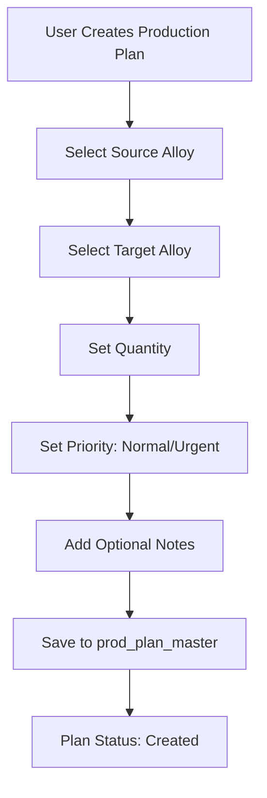
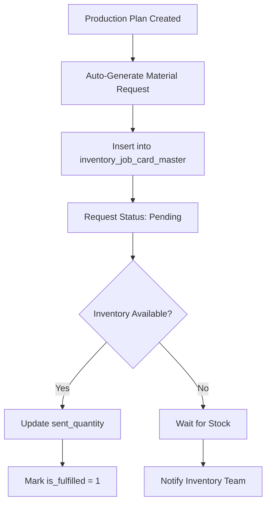
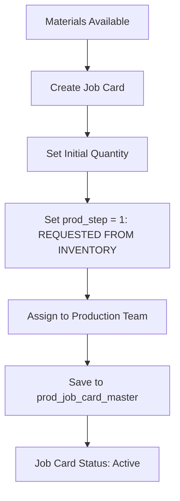
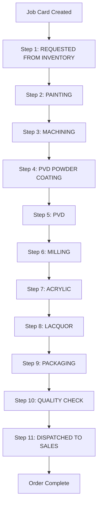
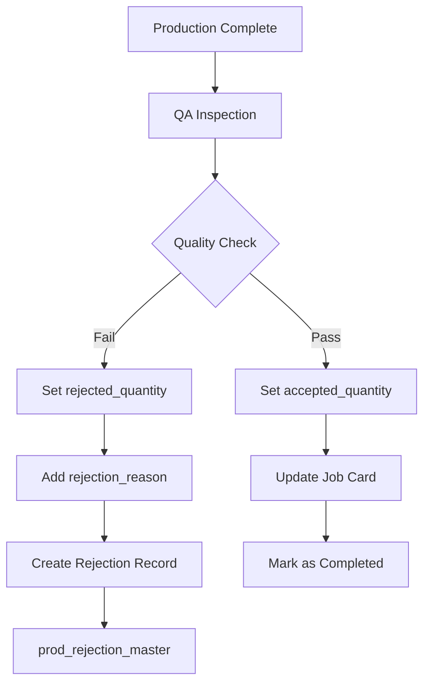
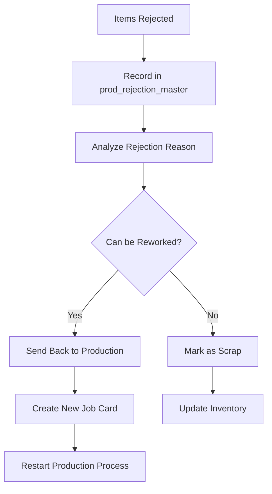
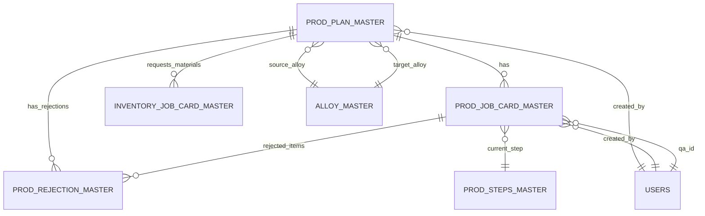

# Production System - Actual Flow Documentation

## Overview

This document describes the complete production tracking system flow based on the actual database schema and codebase implementation of the Plati India ERP system.

## Database Schema Analysis

### Core Production Tables

#### 1. **prod_plan_master** - Production Planning

```sql
CREATE TABLE prod_plan_master (
  id BIGINT PRIMARY KEY AUTO_INCREMENT,
  alloy_id INT NOT NULL,                    -- Source alloy (FK to alloy_master)
  convert_to_alloy_id INT NOT NULL,         -- Target alloy (FK to alloy_master)
  quantity BIGINT NOT NULL,                 -- Total quantity to produce
  in_production_quantity BIGINT NOT NULL,   -- Currently in production
  urgent TINYINT NOT NULL DEFAULT 0,        -- Priority flag (0=normal, 1=urgent)
  note VARCHAR(255),                        -- Optional notes
  is_completed TINYINT DEFAULT 0,           -- Completion status
  created_by INT NOT NULL,                  -- User who created (FK to users)
  created_at DATETIME DEFAULT CURRENT_TIMESTAMP,
  updated_at DATETIME
);
```

#### 2. **prod_job_card_master** - Job Card Management

```sql
CREATE TABLE prod_job_card_master (
  id INT PRIMARY KEY,
  prod_plan_id BIGINT NOT NULL,             -- Link to production plan
  quantity BIGINT NOT NULL,                 -- Job card quantity
  prod_step INT NOT NULL,                   -- Current production step (FK to prod_steps_master)
  created_by INT NOT NULL,                  -- User who created
  created_at DATETIME DEFAULT CURRENT_TIMESTAMP,
  updated_at DATETIME,
  qa_id INT,                                -- QA person assigned
  accepted_quantity BIGINT,                 -- QA accepted quantity
  rejected_quantity BIGINT,                 -- QA rejected quantity
  rejection_reason TEXT,                    -- Reason for rejection
  later_acceptance_reason TEXT              -- Reason for later acceptance
);
```

#### 3. **prod_steps_master** - Production Steps Definition

```sql
CREATE TABLE prod_steps_master (
  id INT PRIMARY KEY AUTO_INCREMENT,
  step_name VARCHAR(150) NOT NULL,          -- Step name
  created_at DATETIME DEFAULT CURRENT_TIMESTAMP,
  updated_at DATETIME
);
```

**Current Production Steps (11 Total):**

1. **REQUESTED FROM INVENTORY** (ID: 1) - Material collection from warehouse
2. **PAINTING** (ID: 2) - Base paint application
3. **MACHINING** (ID: 3) - Precision machining and shaping
4. **PVD POWDER COATING** (ID: 4) - Physical Vapor Deposition powder coating
5. **PVD** (ID: 5) - Physical Vapor Deposition process
6. **MILLING** (ID: 6) - Precision milling operations
7. **ACRYLIC** (ID: 7) - Acrylic coating application
8. **LACQUOR** (ID: 8) - Lacquer finishing
9. **PACKAGING** (ID: 9) - Final packaging for shipment
10. **QUALITY CHECK** (ID: 10) - Final quality inspection
11. **DISPATCHED TO SALES** (ID: 11) - Ready for customer delivery

#### 4. **prod_rejection_master** - Rejection Tracking

```sql
CREATE TABLE prod_rejection_master (
  id INT PRIMARY KEY AUTO_INCREMENT,
  prod_plan_id BIGINT NOT NULL,             -- Link to production plan
  prod_job_card_id INT NOT NULL,            -- Link to job card
  is_resolved TINYINT NOT NULL DEFAULT 0,   -- Resolution status
  created_by INT NOT NULL,                  -- User who reported
  created_at DATETIME DEFAULT CURRENT_TIMESTAMP,
  updated_at DATETIME
);
```

#### 5. **inventory_job_card_master** - Material Requests

```sql
CREATE TABLE inventory_job_card_master (
  id INT PRIMARY KEY AUTO_INCREMENT,
  prod_plan_id BIGINT NOT NULL,             -- Link to production plan
  requested_quantity BIGINT NOT NULL,       -- Requested material quantity
  sent_quantity BIGINT,                     -- Actually sent quantity
  is_fulfilled TINYINT NOT NULL DEFAULT 0,  -- Fulfillment status
  created_by INT NOT NULL,                  -- User who requested
  created_at DATETIME DEFAULT CURRENT_TIMESTAMP,
  updated_at TIMESTAMP DEFAULT CURRENT_TIMESTAMP ON UPDATE CURRENT_TIMESTAMP
);
```

#### 6. **alloy_master** - Product Information

```sql
CREATE TABLE alloy_master (
  id INT PRIMARY KEY AUTO_INCREMENT,
  model_id INT NOT NULL,                    -- Product model
  cb_id INT NOT NULL,                       -- Center bore
  diameter_id INT,                          -- Diameter specification
  finish_id INT NOT NULL,                   -- Finish type
  holes_id INT NOT NULL,                    -- Number of holes
  inches_id INT NOT NULL,                   -- Size in inches
  offset_id INT NOT NULL,                   -- Offset specification
  pcd_id INT NOT NULL,                      -- PCD (Pitch Circle Diameter)
  width_id INT NOT NULL,                    -- Width specification
  in_house_stock BIGINT NOT NULL DEFAULT 0, -- Current stock
  showroom_stock BIGINT DEFAULT 0,          -- Showroom stock
  created_by INT,
  created_at DATETIME DEFAULT CURRENT_TIMESTAMP,
  updated_at TIMESTAMP DEFAULT CURRENT_TIMESTAMP ON UPDATE CURRENT_TIMESTAMP,
  product_name VARCHAR(255) NOT NULL,       -- Full product name
  model_name VARCHAR(100) NOT NULL,         -- Model name
  unique_id VARCHAR(200)                    -- Unique identifier
);
```

## Complete Production Flow

### 1. **Production Planning Phase**



**API Endpoint:** `POST /api/v2/production/add-production-plan`

**Database Operation:**

```sql
INSERT INTO prod_plan_master (
  alloy_id, convert_to_alloy_id, quantity,
  in_production_quantity, urgent, note, created_by
) VALUES (?, ?, ?, 0, ?, ?, ?);
```

### 2. **Material Request Phase**



**Database Operation:**

```sql
INSERT INTO inventory_job_card_master (
  prod_plan_id, requested_quantity, created_by
) VALUES (?, ?, ?);
```

### 3. **Job Card Creation Phase**



**API Endpoint:** `POST /api/v2/production/add-production-job-card`

**Database Operation:**

```sql
INSERT INTO prod_job_card_master (
  prod_plan_id, quantity, prod_step, created_by
) VALUES (?, ?, 1, ?);
```

### 4. **Production Step Progression**



**Detailed Step Progression:**

- **Steps 1-3:** Initial processing (Material → Painting → Machining)
- **Steps 4-5:** Advanced coating processes (PVD Powder Coating → PVD)
- **Step 6:** Precision finishing (Milling)
- **Steps 7-8:** Final coating (Acrylic → Lacquer)
- **Steps 9-11:** Completion (Packaging → Quality Check → Dispatch)

**API Endpoint:** `POST /api/v2/production/update-production-job-card`

**Database Operation:**

```sql
UPDATE prod_job_card_master
SET prod_step = ?, updated_at = NOW()
WHERE id = ?;
```

### 5. **Quality Assurance Phase**



**API Endpoint:** `POST /api/v2/production/add-qa-production-card-report`

**Database Operations:**

```sql
-- Update job card with QA results
UPDATE prod_job_card_master
SET qa_id = ?, accepted_quantity = ?, rejected_quantity = ?,
    rejection_reason = ?, updated_at = NOW()
WHERE id = ?;

-- If rejected, create rejection record
INSERT INTO prod_rejection_master (
  prod_plan_id, prod_job_card_id, created_by
) VALUES (?, ?, ?);
```

### 6. **Rejection Handling Phase**



**API Endpoint:** `POST /api/v2/production/add-production-rejection-card`

## Data Relationships



## API Endpoints Summary

| Endpoint                          | Method | Purpose                | Database Tables                                 |
| --------------------------------- | ------ | ---------------------- | ----------------------------------------------- |
| `/get-steps`                      | GET    | Get production steps   | `prod_steps_master`                             |
| `/add-production-plan`            | POST   | Create production plan | `prod_plan_master`                              |
| `/add-production-job-card`        | POST   | Create job card        | `prod_job_card_master`                          |
| `/update-production-job-card`     | POST   | Update job card step   | `prod_job_card_master`                          |
| `/add-qa-production-card-report`  | POST   | QA results             | `prod_job_card_master`, `prod_rejection_master` |
| `/add-production-rejection-card`  | POST   | Handle rejections      | `prod_rejection_master`                         |
| `/get-production-plan-report`     | GET    | Plan reports           | `prod_plan_master` + joins                      |
| `/get-production-job-card-report` | GET    | Job card reports       | `prod_job_card_master` + joins                  |

## Key Features

### ✅ **Implemented Features**

1. **Multi-step Production Process** - 3 defined steps with progression tracking
2. **Quality Assurance Integration** - Built-in QA with accept/reject functionality
3. **Rejection Management** - Dedicated rejection tracking and resolution
4. **Inventory Integration** - Automatic material request system
5. **Priority Management** - Urgent vs normal priority handling
6. **Audit Trail** - Complete tracking of who did what and when
7. **Reporting System** - Comprehensive reporting for plans and job cards

### 🔄 **Production Flow States**

1. **Planning** → `prod_plan_master.is_completed = 0`
2. **Material Request** → `inventory_job_card_master.is_fulfilled = 0`
3. **In Production** → `prod_job_card_master.prod_step = 1,2,3`
4. **Quality Check** → `prod_job_card_master.qa_id IS NOT NULL`
5. **Completed/Rejected** → Based on QA results

### 📊 **Tracking Capabilities**

- **Quantity Tracking** - Planned vs In-Production vs Completed
- **Step Progression** - Real-time status of each job card
- **Quality Metrics** - Acceptance/rejection rates
- **Material Usage** - Requested vs sent quantities
- **User Activity** - Who created/updated each record
- **Time Tracking** - Creation and update timestamps

## Sample Data Flow

```
Production Plan: Convert 100 units of Alloy A to Alloy B
├── Material Request: Request 100 units of Alloy A
├── Job Card 1: 50 units (Step 1 → 2 → 3 → QA: 45 accepted, 5 rejected)
├── Job Card 2: 50 units (Step 1 → 2 → 3 → QA: 48 accepted, 2 rejected)
└── Rejection Records: 7 units total rejected with reasons
```

This production system provides comprehensive tracking from planning through completion, with built-in quality control and rejection management.
